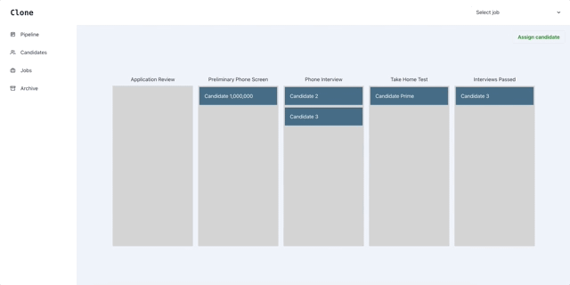
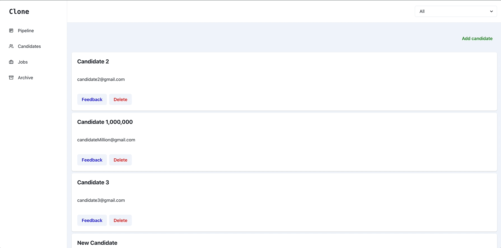
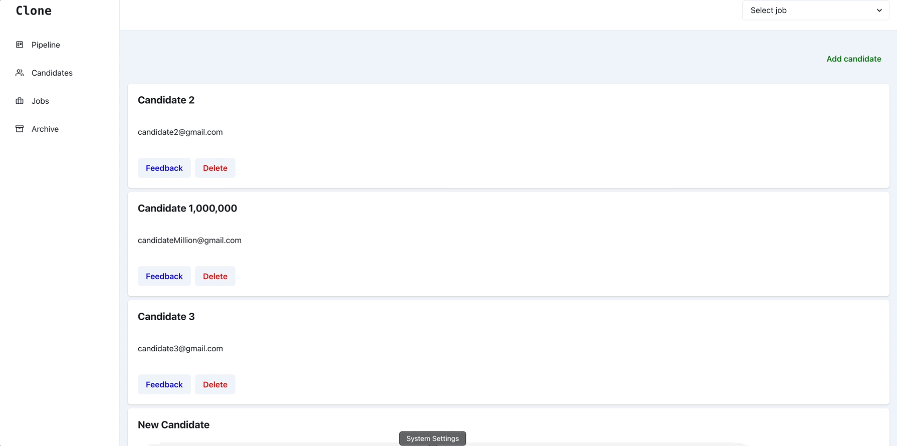
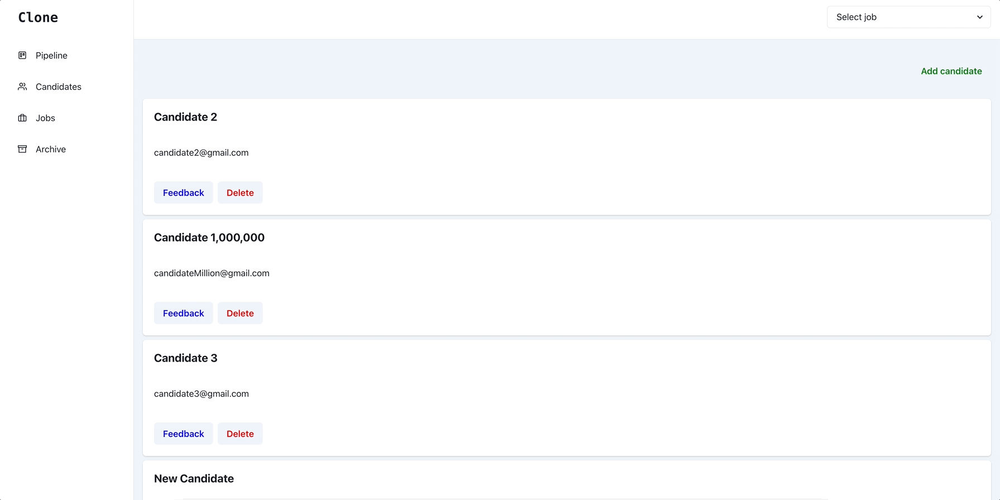
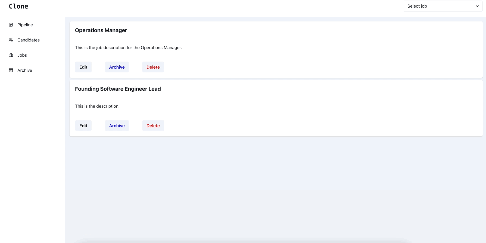
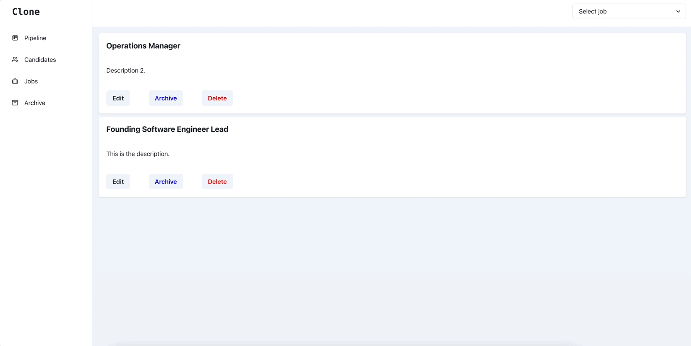
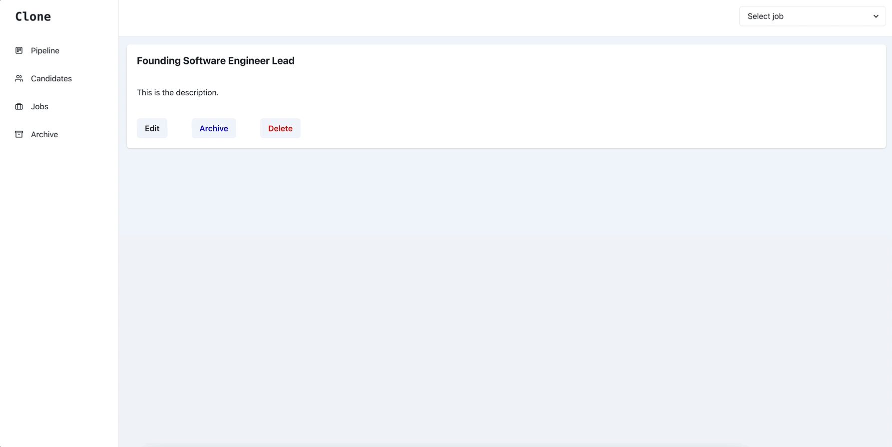
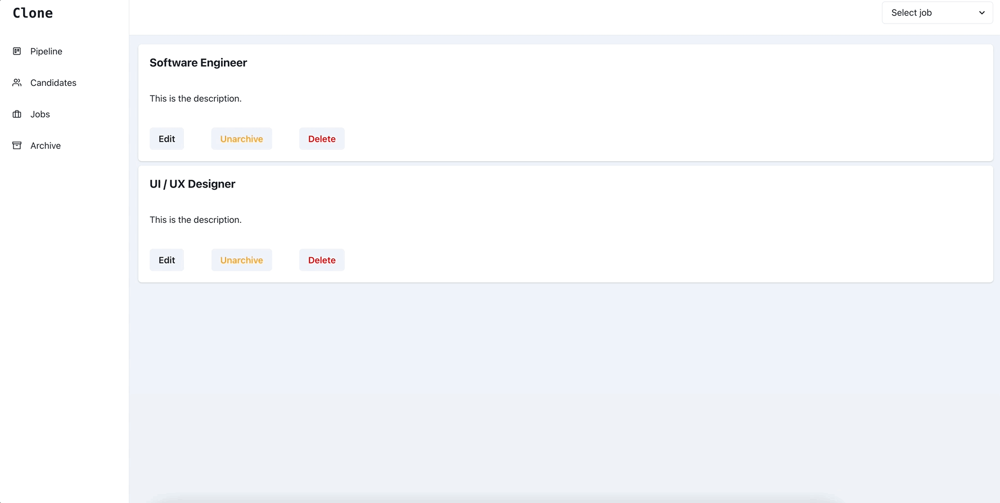

# Found - Frontend

This is the frontend of Found - a simplified version of [_Wellfound_](https://wellfound.com/) (previously AngelList) focused on basic candidate management from a hiring manager's point of view. The user interface is an admin-like dashboard that enables the manipulation of candidates, job postings, an archive of the job postings, and the assignment of candidates to interview stages of a job.

## Table of Contents
* [Technologies Used](#technologies-used)
* [Usage](#usage)
* [Setup](#setup)
* [Future Developments](#future-developments)
* [Contact](#contact)

## Technologies Used

* Next.js v2.4.2
* React v18
* TypeScript v5
* Chakra UI v2.10.2

## Usage

The usage of Found will be segmented by the features/functionalities relevant to each page:

* Pipeline
* Candidates
* Jobs
* Archive

The "Candidate" and "Job" objects seen in the forthcoming GIFs are used for demonstration purposes and will not be present on a new running instance of this GitHub project cloned. 

### Pipeline

The "Pipeline" page is the entry point and home page of Found. A hollistic drag and drop column-wise overview of candidates within interview stages of a job or all jobs can be seen.

#### Feature: Viewing interview stages of candidates by job selector

The interview stages of candidates for a certain job can be selected by the top right dropdown menu. The "All" option will show the interview stages of all candidates across all jobs.
If the job selector is unused, it will default to the "All" option.

#### Feature: Assigning candidates to interview stages by drag and drop

Candidates can be assigned to different interview stages of a job by dragging and dropping the card with their name to the target interview stage. The GIF full page 
refreshes towards the end and indicates that the candidate's latest interview stage assignment before the page refresh was correctly recorded on the backend.

#### Feature: Assigning candidates to interview stages by "Assign candidate" button

Candidates can be assigned to different interview stages of a job by using the "Assign candidate" button. Upon clicking the "Assign candidate" button, the user will be prompted to select the desired candidate, job, and interview stage. This button allows assigning candidates to interview stages of other jobs, an ability not achievable using the drag and drop feature.

### Candidates

The "Candidates" page manages individual candidates more directly. Within this page, candidates can be viewed by a job using the top right selector alongside adding, editing, and deleting certain candidates.

#### Feature: Viewing candidates by job selector

Candidates can be viewed by a certain job using the top right dropdown menu. Candidates are considered "under a job" if they are assigned to an interview stage for that job.

#### Feature: Adding feedback to candidates

Individual candidates can be given feedback by clicking on the "Feedback" button, clicking "Submit" after filling out the text area, refreshing the page, and locating the candidate once more.

#### Feature: Adding candidates

Individual candidates can be added by clicking on the "Add candidate" button, entering the details, clicking "Create", and refreshing the page.

#### Feature: Deleting candidates

Individual candidates can be deleted by clicking on the "Delete" button, clicking "Yes", and refreshing the page.

### Jobs

The "Jobs" page manages individual jobs more directly. Within this page, jobs can be viewed, edited, archived, and deleted.

#### Feature: Edit description of job

Job descriptions can be edited by clicking the "Edit", filling out the text area, and refreshing the page.

#### Feature: Archiving jobs

Individual jobs can be archived by clicking the "Archive", clicking "Yes", and viewing the archived job in the "Archive" page.

#### Feature: Deleting jobs

Individual jobs can be deleted by clicking on the "Delete" button, clicking "Yes", and refreshing the page.

### Archive

The "Archive" page manages individual archived jobs. Archived jobs share similar functionality to the jobs on the "Jobs" page but only differs with the "Unarchive" feature.

#### Feature: Unarchiving jobs

Jobs can be unarchived and passed back to the "Jobs" by clicking "Unarchive", clicking "Yes", and visiting the "Jobs" page.

## Setup

To setup the application, [_npm_](https://docs.npmjs.com/downloading-and-installing-node-js-and-npm) or [_yarn_](https://classic.yarnpkg.com/lang/en/docs/install/#mac-stable) are required.

1. Open your terminal and `git clone` the GitHub repository URL in your desired directory.
2. Navigate to the cloned directory with `cd <cloned_repository>` and install the project's dependencies with `npm install` or `yarn install`.
3. Verify [_Found - Backend_](https://github.com/ah-berry/Found--Backend) is running on http://localhost:8000.
4. Run the application with `npm run dev` or `yarn dev`.
5. Open the application on your browser of choice with http://localhost:3000.

## Future Developments

There are things that can be added to improve on the code quality and user experience of Found in the future. Here are some of the developments I can forsee and maybe you, as one of the wonderful users of Found :smiley:, have already identified:

- Addition of a sign-on, sign-in, and sign-out authentication flow for users.
- Addition of user settings like profile customization.
- Addition of different user roles (i.e. admin and generic consumers) and privileges (i.e. admin and generic consumers with differing capabilities).
- "try...catch" statements and error handling for API calls.
- Persisting job option choice from selector globally across pages.
- Informative page centered texts if there are no candidates, jobs, or archived jobs.
- More industry-standard and "aesthetically pleasing" styling for drag and drop "Pipeline" display and "Candidate" and "Job" cards.
- Landscape search new drag and drop REACT library (as [_react-beautiful-dnd_](https://github.com/atlassian/react-beautiful-dnd) is slated to deprecate) or custom build one from scratch.

## Contact

The application was created by yours truly! Feel free to follow me on [_LinkedIn_](https://www.linkedin.com/in/ahmed-gorashi-546447b5/) and let me know if you liked using Found!

